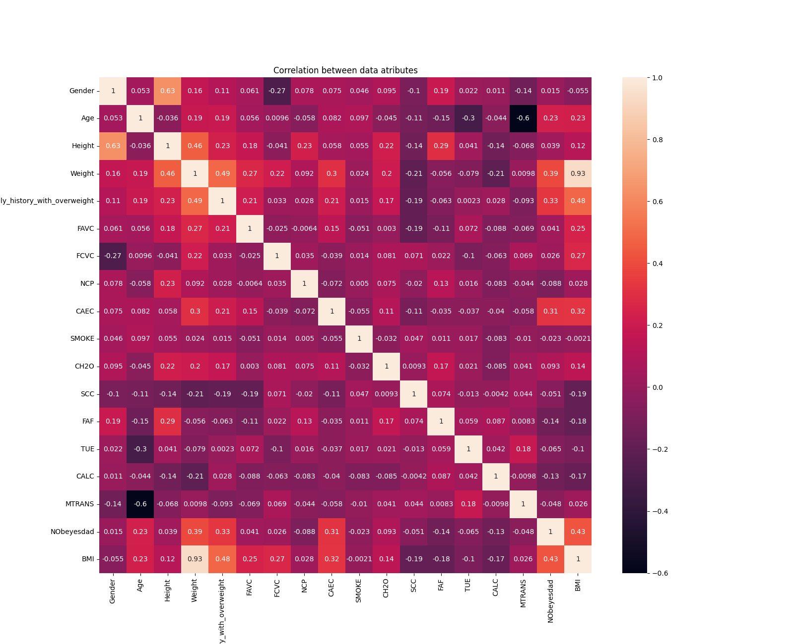
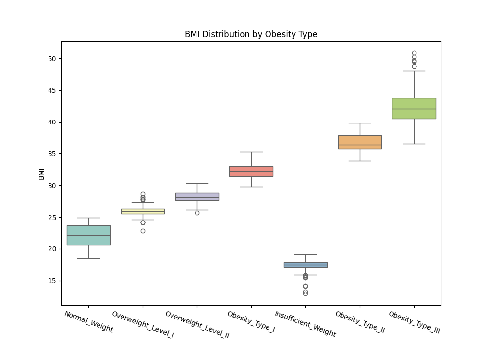
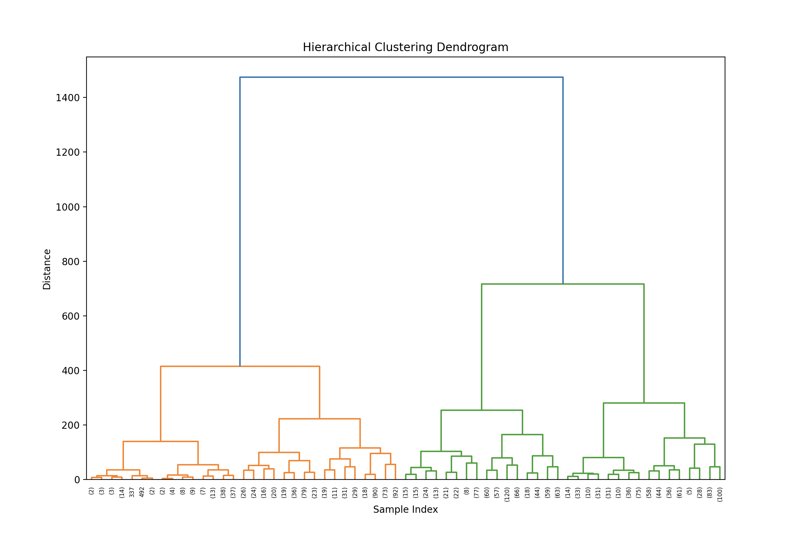
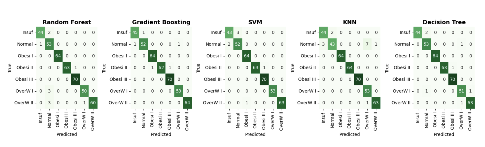
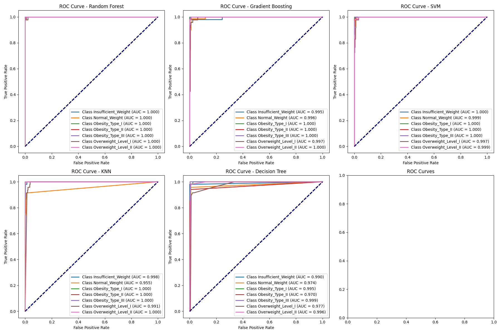
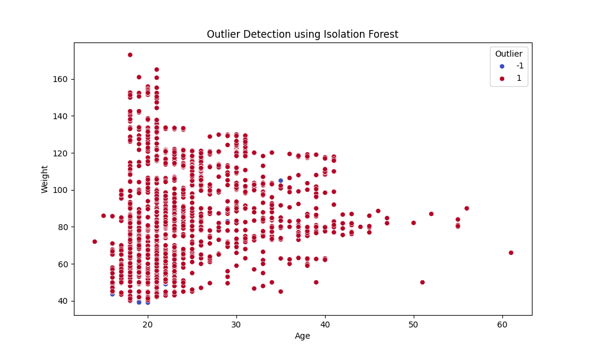
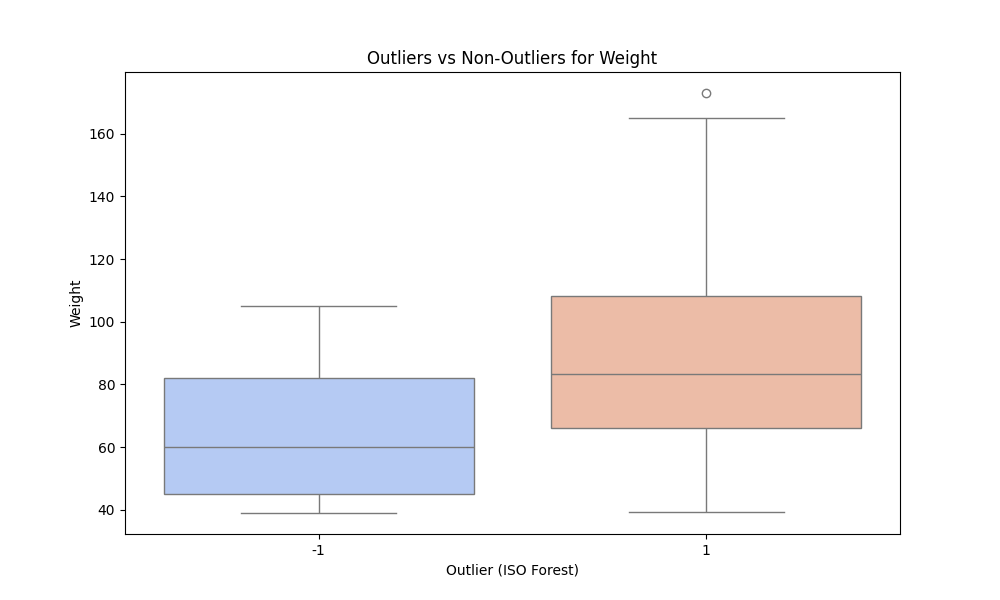
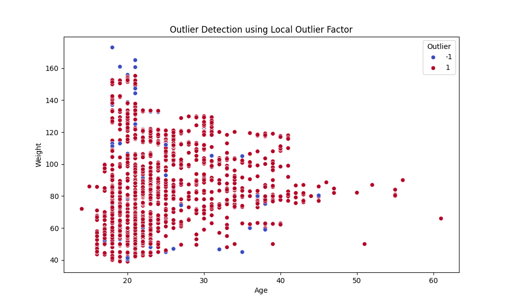
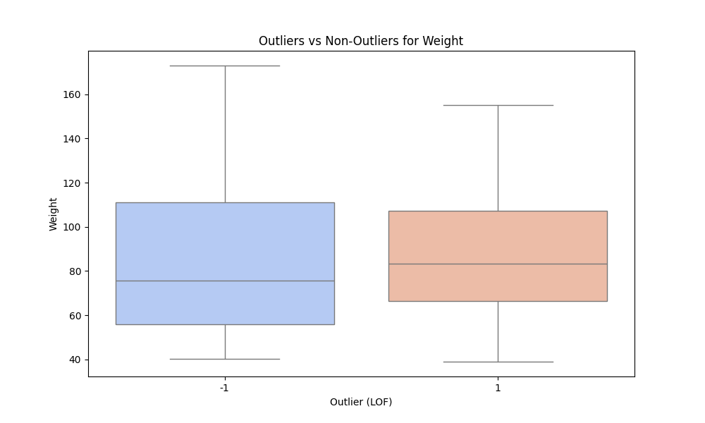
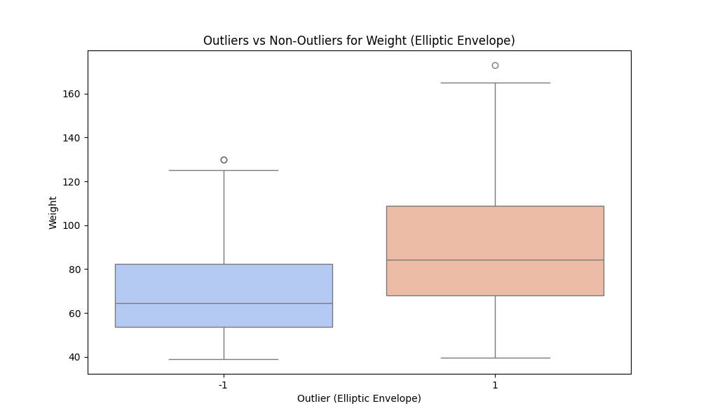

# Cmpt-459-project - Obesity Analysis in Latin America

This dataset focuses on estimating obesity levels in individuals from Mexico, Peru, and Colombia, based on their eating habits and physical condition. It consists of 2,111 records with 16 features and a target variable (`NObesity`) that represents obesity levels.

## Key Features:
- **Global Relevance:** Addresses obesity, a critical global health issue, with data sourced from diverse populations in three countries.
- **Data Integrity:** Nearly complete dataset with minimal missing values, ensuring reliability and straightforward preprocessing.
- **Feature Diversity:** Includes categorical, binary, and continuous variables, offering rich opportunities for analysis and feature engineering.
- **Synthetic Data:** 77% of the data is synthetically generated, preserving realistic patterns while addressing privacy concerns.
- **Cross-Cultural Analysis:** Covers data from multiple countries, enabling comparative and cross-cultural studies on obesity factors.
- **Machine Learning Ready:** With a clear target variable (`NObesity`), it supports various machine learning tasks such as classification, regression, and clustering.

## Language:
- Python 

## Libraries Used:
- Pandas
- NumPy
- Scikit-learn
- Matplotlib
- Seaborn
- Pathlib
- SciPy
- OS

## Data Preprocessing

#### Dataset Loading
- The dataset was loaded using **Pandas** for efficient data manipulation.
- Configured to display all columns for easier inspection during analysis.

#### Duplicate Removal
- Duplicate rows were identified and removed to maintain data integrity:
  ```python
  data = data.drop_duplicates()
  ```

#### Handling Missing Values
- Checked for missing values using:
  ```python
  data.isnull().sum()
  ```
- The analysis confirmed that there are no missing values in the dataset, as all columns returned a sum of `0`.

#### Normalization and Standardization
- After analyzing the dataset, feature scaling techniques such as **Min-Max Scaling** and **StandardScaler** were considered.
- However, the dataset's numerical features were already appropriately scaled, eliminating the need for additional scaling transformations.

## Exploratory Data Analysis (EDA)

### Key Insights:
- **Average Age by Obesity Type:**
  The average age increases with obesity levels, peaking in Obesity Type II.
- **Average Weight by Obesity Type:**
  Obesity Type II has higher average weight than Type III due to data distribution.
- **High-Calorie Food Impact:**
  Obesity Type III individuals exclusively consume high-calorie food.
- **Family History:**
  A positive correlation exists between family history of obesity and higher weight categories.

## Feature Engineering
### Correlation between attributes


### BMI Calculation:
- A new feature, BMI, was added to the dataset
```python
  data['BMI'] = round(data['Weight'] / (data['Height'] ** 2), 2)
  ```


### Advantages:
- Directly correlates with obesity levels.
- Serves as a strong predictor for machine learning models.


## Clustering Techniques

### K-Means Clustering
- Optimal Clusters: 2 clusters, determined by Silhouette Score and Davies-Bouldin Index.
#### Cluster Insights:
- Cluster 1: Individuals with healthier habits.
- Cluster 2: Individuals with higher BMI and unhealthy habits.


### DBSCAN
- Clustering at eps=4.5 with 2 clusters confirms well-separated and interpretable clusters.
- Achieved improved cluster separation while minimizing noise.


### Hierarchical Clustering
- Dendrogram Analysis: Indicated 2 primary clusters with meaningful separations.

- Agglomerative Clustering 


## Classification Models and Results
### Models Evaluated
The following models were tested for their effectiveness in classifying obesity levels:

1. **Random Forest**
2. **Gradient Boosting**
3. **Support Vector Machines (SVM)**
4. **K-Nearest Neighbors (KNN)**
5. **Decision Tree**

Each model was evaluated using standard metrics, including:
- **Accuracy**
- **Precision**
- **Recall**
- **F1 Score**


### Best Model: Random Forest (With Hyperparameter Tuning)
The **Random Forest** classifier emerged as the top-performing model after comprehensive hyperparameter tuning. 

#### Performance Metrics:
- **Accuracy**: 98%
- **Precision**: 98%
- **Recall**: 98%
- **F1 Score**: 98%

#### Tuning Details:
The following hyperparameters were optimized using **GridSearchCV**:
- `n_estimators` (Number of trees)
- `max_depth` (Maximum depth of each tree)

The grid search systematically explored combinations of C, gamma, and kernel, identifying the optimal set of parameters for your data. Before tuning, the default parameters might not have been suitable for your dataset, leading to suboptimal performance.



### Model Comparisons
The table below summarizes the performance of all evaluated models:

| Model                | Accuracy | Precision | Recall | F1 Score |
|----------------------|----------|-----------|--------|----------|
| Random Forest        | 98%      | 98%       | 98%    | 98%      |
| Gradient Boosting    | 97%      | 97%       | 97%    | 97%      |
| Support Vector Machines (SVM) | 97%      | 97%       | 97%    | 97%      |
| K-Nearest Neighbors (KNN) | 96%  | 96%       | 96%    | 96%      |
| Decision Tree        | 95%      | 95%       | 95%    | 95%      |


### Key Insights from Model Comparisons:
1. **Gradient Boosting**:
   - Strong performance with 97% accuracy, though slightly underperformed compared to Random Forest.
   
2. **Support Vector Machines (SVM)**:
   - Tuned with parameters like `C`, `gamma`, and `kernel`, achieving 97% accuracy.
   
3. **K-Nearest Neighbors (KNN)**:
   - Achieved 96% accuracy but was sensitive to the choice of `k`.

4. **Decision Tree**:
   - Easy to interpret but slightly overfitted, achieving 95% accuracy.

### Why Random Forest Excelled
- **Robustness**: Aggregates predictions from multiple decision trees, minimizing overfitting and improving generalization.
- **Feature Importance**: Offers clear insights into which features (like BMI, weight, and age) are most predictive, aiding interpretability.



## Outlier Detection
To ensure data quality and enhance model performance, the following outlier detection methods were applied:

1. **Isolation Forest**:
   - Identified **105 outliers** in the dataset.
     
   - Variation
     
2. **Local Outlier Factor (LOF)**:
   - Detected **100 outliers**, indicating similar data irregularities.
     
   - Variation
     
3. **Elliptic Envelope**:
   - Highlighted common outliers across the dataset and contributed to removing anomalies that adversely impacted model performance.
     
   - Variation
     
     
## Learnings

### Data Selection and Quality
- The dataset highlights the interplay between biological and behavioral factors in obesity.
- Diverse features and clear classification targets made the dataset ideal for supervised learning tasks.

### Feature Engineering
- Adding derived features like **BMI** significantly improved model accuracy.
- Mutual information scores helped identify key numerical and categorical features for modeling.

### Clustering Insights
- **K-Means Clustering**: k=2 effectively separated healthy and unhealthy individuals.
- **Hierarchical Clustering**: Confirmed optimal clustering at 2 groups based on shared traits.

### Outlier Detection
- Techniques used: **Isolation Forest**, **LOF**, and **Elliptic Envelope**.
- Common outliers across these methods were removed to improve model performance.

### Classification and Tuning
- **Gradient Boosting** emerged as the best classifier, achieving an **F1-Score** of 0.9879.
- **SVM** performance significantly improved with hyperparameter tuning (optimized `C`, `gamma`, and kernel).


## Outcomes

### Best Classifier
- **Gradient Boosting** achieved the highest performance among all classifiers.

### Performance Metrics
| Model              | Training Accuracy | Test Accuracy | Best F1-Score |
|---------------------|-------------------|---------------|---------------|
| Gradient Boosting   | 0.99              | 0.98          | 0.9879        |
| SVM                | 0.9862            | 0.9737        | 0.9600        |
| KNN                | 0.9754            | 0.9593        | 0.9500        |
| Decision Tree       | 0.9832            | 0.9545        | 0.9500        |

### Domain Insights
- Obesity levels are closely linked to **age**, **weight**, food consumption habits, and family history.
- Clustering helped segment individuals based on shared behavioral and physiological characteristics.

### Key Methods
- **Clustering**: K-Means, Hierarchical Clustering, DBSCAN.
- **Outlier Detection**: Isolation Forest, LOF, Elliptic Envelope.
- **Classification**: Gradient Boosting, Random Forest, SVM, KNN, Decision Tree.
- **Feature Engineering**: Derived **BMI** as a key feature for classification.


## Lessons Learned

- **Feature Engineering**: Added features like BMI significantly improved prediction.
- **Outlier Detection**: Removing common outliers among methods enhanced performance.
- **Clustering**: Showed how behavioral traits divide obesity levels effectively.
- **Hyperparameter Tuning**: Highlighted the importance of tuning for optimizing model performance.


